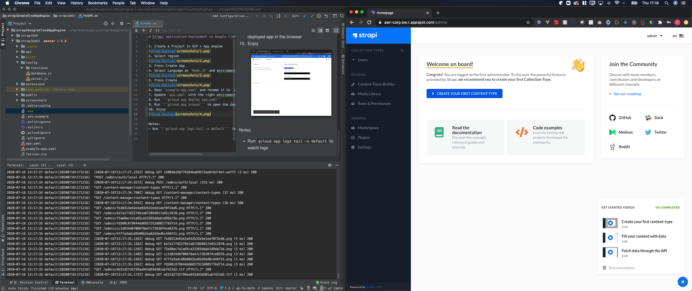

# Strapi application Deployment on Google Cloud

1. Create a Project in GCP > App engine 

2. Select region

3. Press Create App
4. Select Language as `Node.JS` and enviroment as `Standard` 

5. Press Create

6. Open `example-app.yaml` and rename it to `app.yaml`
7. Update `app.yaml` with the right enviroment variables
8. Run ```gcloud app deploy app.yaml```
9. Run ```gcloud app browse``` to open the deployed app in the browser
10. Enjoy
 

Notes:
- Run ```gcloud app logs tail -s default``` to watch logs

